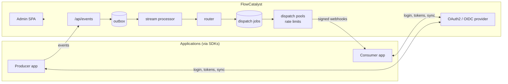

# Platform Overview

FlowCatalyst is an event-driven integration platform: applications publish
business events into it, and it takes responsibility for everything that
should happen next — validating them against their event types, routing
them through subscriptions, delivering them to consumers as signed
webhooks with retries and rate limits, and giving operators one place to
see, audit, and intervene in all of it. Around that messaging core it
provides the identity plane those applications share: a full OAuth2/OIDC
provider with federated login, roles and permissions, service accounts,
and customer-portal identities.

## What the platform does

| Capability | In short |
|---|---|
| **Event ingestion** | Applications POST events (singly or in batches) against registered **event types** with optional JSON schemas. |
| **Routing** | **Subscriptions** bind event types to consumers; the router turns matched events into **dispatch jobs**. |
| **Delivery** | Dispatch jobs deliver as HMAC-signed webhooks with retries, backoff, and per-pool rate limiting (**dispatch pools**). |
| **Scheduling** | **Scheduled jobs** fire on cron expressions with locking, retention, and instance tracking. |
| **Processes** | Multi-step process definitions with diagrams, instances, and logs. |
| **Identity** | OAuth2/OIDC provider: interactive login (password, passkey, org SSO), 2FA, service accounts, token issuance. |
| **Access control** | Roles built from 4-segment permissions, delegable to client administrators, synced from application SDKs. |
| **Portals** | A separate end-user identity plane so clients can run customer portals — see *Portal Users*. |
| **Administration** | The admin SPA: every resource above plus audit logs, login attempts, raw-event debugging, theming, and this documentation. |

## The tenancy model

- **Clients** (`clt_…`) are the tenants — the businesses on the platform.
- Every principal has a **tier**: `ANCHOR` (platform staff/operators —
  cross-tenant), `PARTNER` (spans a set of clients), or `CLIENT` (confined
  to one client). Tier travels in tokens as `tier`; granted permissions
  travel as `scope`.
- **Applications** (`app_…`) are the integration units — the systems that
  publish and consume events. Clients are entitled to applications through
  client configs; users and service accounts are confined to the
  applications they may access.

## How the pieces talk

Applications self-register their resources at boot through the **SDK sync
surface** — event types, subscriptions, roles, scheduled jobs, OpenAPI
specs, and documentation pages are all declared in the application's code
and pushed declaratively (see *Applications & Integration*).

## Where to go next

- **Messaging & Delivery** — the event pipeline end to end.
- **Identity & Access** — principals, tokens, federation, 2FA.
- **Portal Users** — the customer-portal identity plane.
- **Applications & Integration** — SDKs, sync surfaces, credentials.
