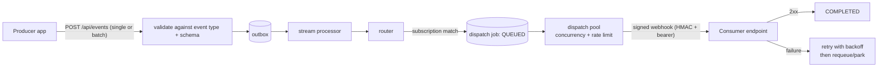

# Messaging & Delivery

The messaging core moves a business event from a producer's database
commit to a consumer's webhook endpoint with at-least-once delivery,
ordering within a group, and operator visibility at every hop.

## The pipeline

- **Event types** (`evt_…`) are registered per application (usually synced
  from the SDK) and may carry JSON schemas; ingestion validates against
  them.
- **The outbox** decouples ingestion from processing: accepting an event
  and processing it are separate, restart-safe steps. Producer apps using
  the SDKs get the same pattern on their side — events are written with
  their local transaction and relayed afterwards, so a crash never loses
  or double-invents an event.
- **The stream processor** moves accepted events forward and hands them to
  the router. In multi-instance deployments the processors are
  leader-gated so per-group ordering (FIFO within a message group) holds.
- **The router** evaluates **subscriptions** — bindings from event types
  to consumer endpoints/queues — and materialises a **dispatch job** per
  delivery. Requeue storms are deduplicated at route time, so re-driving a
  backlog cannot create duplicate deliveries.

## Delivery

- **Dispatch pools** bound delivery: each pool sets concurrency and rate
  limits, so one slow or flooded consumer cannot starve the rest.
- Webhooks authenticate two ways at once: a bearer **auth token** and an
  HMAC-SHA256 **signing secret** (both per service account, rotatable from
  the admin UI — shown once on rotation).
- Failures retry with backoff under the poller's control; jobs that keep
  failing are parked for operator attention rather than retried forever.
  The admin UI supports inspection, single and **bulk requeue**.
- Job lifecycle is visible end to end: QUEUED → PROCESSING → COMPLETED /
  DELIVERY_FAILED, with raw payload debugging for administrators holding
  the view-raw permission.

## Scheduled jobs

Cron-driven work lives in **scheduled jobs** (`sjb_…`): standard cron
expressions, locking so exactly one instance fires per tick even in HA,
signed delivery to the target (bearer + HMAC, like webhooks), instance
tracking with logs, and retention policies. Applications register their
own scheduled jobs through the SDK; the admin UI can pause, fire manually,
and inspect instances. Completion is acknowledged by the consumer; an
instance that never acks stays visible as running rather than silently
vanishing.

## Processes

**Processes** (`prc_…`) are multi-step definitions — diagrams (Mermaid or
structured), steps, and per-instance logs — synced from application code
and visible in the admin UI. They document and track long-running business
flows that span multiple events.

## Operational surfaces

- **Events** and **dispatch jobs** list pages with filtering by
  application, type, and status.
- **Audit log** for administrative changes; **login attempts** for the
  identity plane.
- Batch ingestion endpoints for events, dispatch jobs, and audit logs
  (positional results — one result per submitted item).
