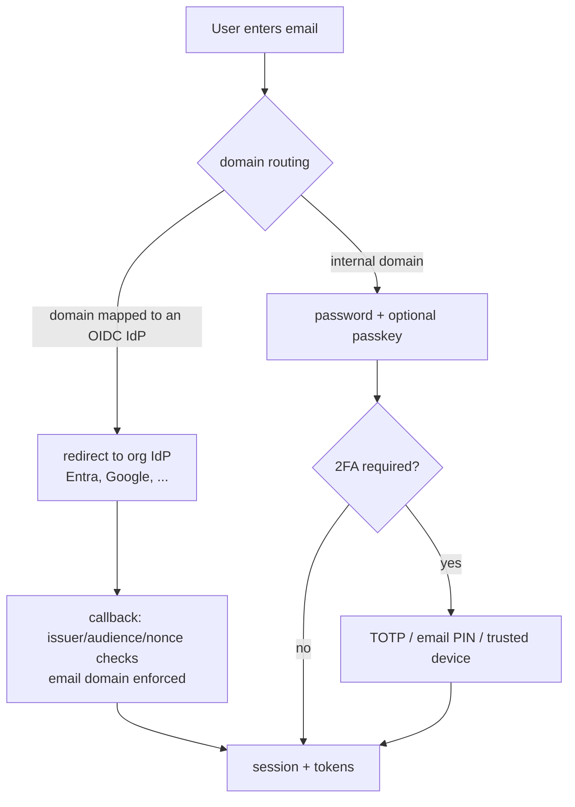

# Identity & Access

FlowCatalyst is a full OAuth2/OIDC provider. Applications never store
credentials or run login screens — they send people to the platform, get
back tokens, and run their own sessions from them. Machines authenticate
with client credentials. Everything that proves identity — passwords,
passkeys, 2FA, federation to corporate IdPs — lives here, once, audited.

## Principals and tiers

- **Users** and **service accounts** are principals (`prn_…`). Every
  principal has a **tier**: `ANCHOR` (platform staff, cross-tenant),
  `PARTNER` (a set of clients), or `CLIENT` (one client).
- **Roles** are named bundles of 4-segment permissions
  (`platform:<context>:<resource>:<action>`), assigned to principals.
  Applications register their own roles via SDK sync; platform roles are
  seeded. Client-managed roles let client administrators run their own
  user management inside their boundary.
- **Service accounts** pair a SERVICE principal with a confidential OAuth
  client and webhook credentials. They are anchor-tier but **confined**:
  an application-scoped service account can only touch its own
  application's resources, enforced on every sync endpoint.

## Tokens: identity vs authority

Interactive logins and machine credentials mint different classes of
token, and the platform API enforces the difference:

| Token | Minted by | Carries | Accepted as API credential |
|---|---|---|---|
| **id_token** | interactive login (OIDC) | who the user is + roles, narrowed to the requesting app | never — apps authenticate from it and run their own session |
| **identity access token** | interactive login | `token_use=identity`, no authority | **rejected** by the API middleware |
| **API access token** | client_credentials, dashboard, refresh | `token_use=api`, tier + roles + granted `scope` (permissions) | yes |

Consequences: a phished browser token cannot drive the API; a relying
app's users get exactly the roles that belong to that app (id_token role
narrowing per OAuth client); and permission grants can be narrowed at
request time — a token asks for scopes and receives the intersection with
its principal's ceiling, never more.

Refresh tokens rotate on every use with family-wide reuse detection (a
replayed old token kills the whole family) and a 7-day absolute cap.
Authorization codes are single-use with PKCE (S256 only).

## Login and federation

- **Identity providers** (`idp_…`) are authenticators for the email
  domains routed to them. Domain → IdP routing lives in one mapping table
  used by every surface. Multi-tenant IdPs (e.g. Entra common) are pinned
  by issuer pattern and allowed domains, so a foreign tenant can never
  mint identities.
- **Role sync**: an IdP can push group claims into platform roles on every
  login, filtered by an allow-list — HR removes someone upstream, their
  next login drops the role.
- **JIT provisioning** creates principals on first federated login using
  the domain mapping's scope and client.

## Second factors and credentials

- **2FA**: TOTP authenticator apps and email PINs, with trusted-device
  "remember this browser", recovery codes, per-domain enforcement policy,
  and admin reset (audited). Password reset for a user with 2FA requires
  the second factor.
- **Passkeys** (WebAuthn) for password-less sign-in.
- **Password policy**: length bounds, common-password list, and no
  identity material (your name or email can't be your password).
  Credentials are only ever typed into platform-hosted pages.
- **Developer credentials**: a user holding the developer role can mint a
  personal API credential (their principal id + a dedicated rotatable
  secret) for client_credentials — no shared service account needed, and
  revoking the role cuts new tokens immediately.
- Admins can mint a short-lived bearer for any service account from the
  admin UI (audited) — for testing, without exposing the client secret.

## Delegation

Client administrators manage their own users, roles, and portal users
inside their client boundary — the permission checks confine every
operation with `CanAccessClient`, so delegation never crosses tenants.
All administrative identity actions land in the audit log, and every
authentication attempt (success or failure, human or machine) lands in
login attempts.
