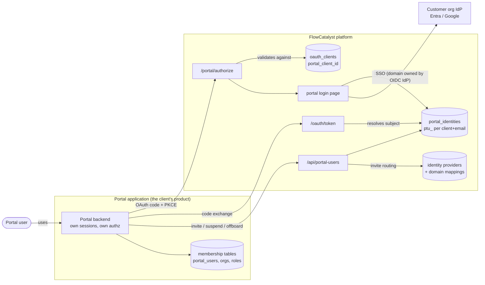
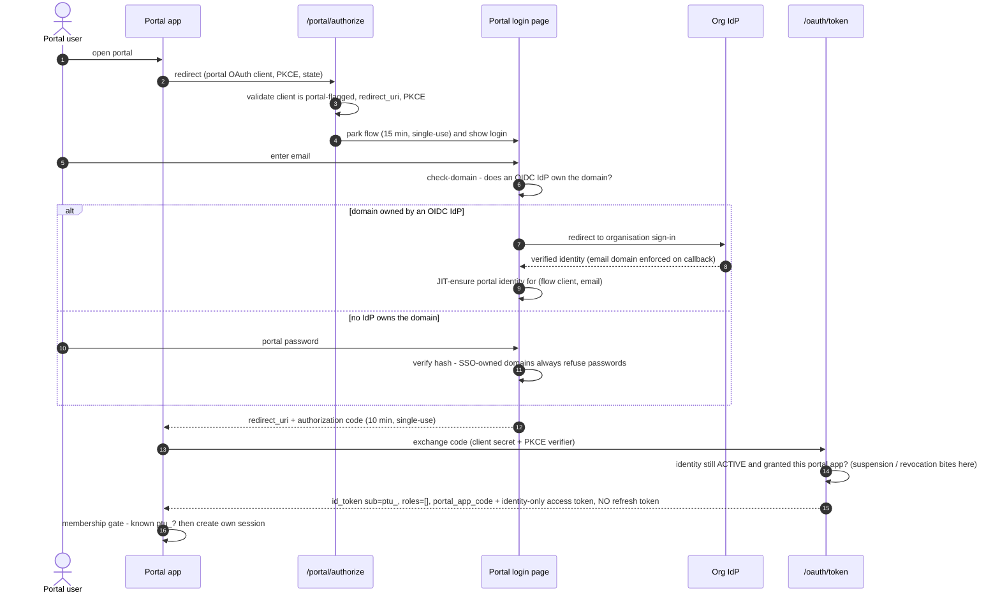
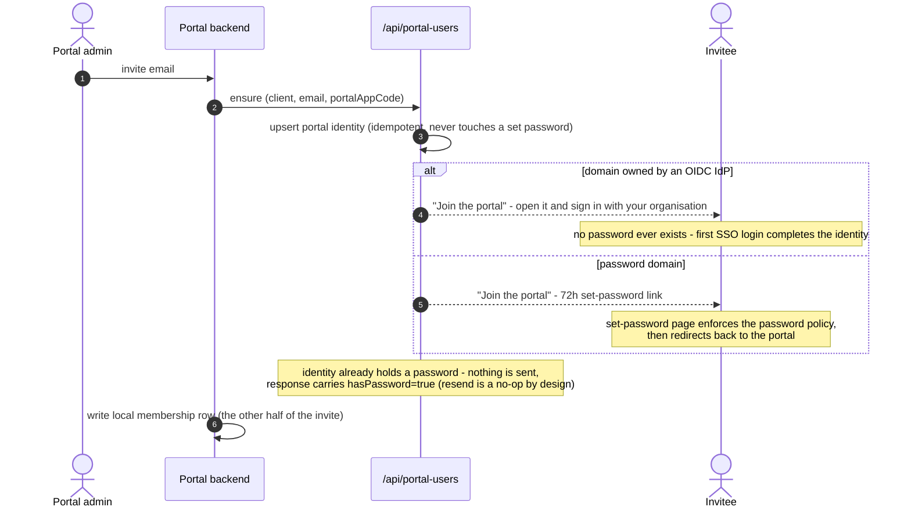
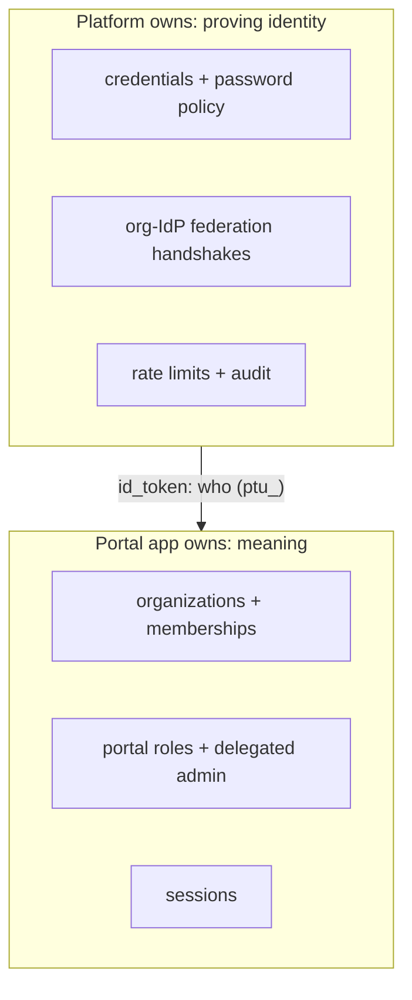

# Portal Users Architecture

*The platform proves who someone is; the portal app decides what they mean.*

FlowCatalyst clients run portals for **their** customers (B2B2B): VALUE
Logistics serves TIGER_BRANDS' people, Inhance serves its clients' people.
Portal users are a **separate identity population** from platform users —
same operator, same audited machinery (password hashing, reset tokens, the
OIDC bridge), but separate storage, separate entry points, and zero shared
authority. A platform administrator and a portal user can be the same
email; they are still two identities with independent credentials.

All diagrams are plain fenced Mermaid blocks — copy them into any tool
that renders Mermaid.

## The four moving parts

| Part | Lives in | What it is |
|---|---|---|
| **Portal identity** | `portal_identities` (platform) | One row per **(client, email)**. Id prefix `ptu_`. Carries email, name, optional password hash, ACTIVE/DISABLED status, the latest invite's dates, and its **portal-app grants**. No roles, no permissions — ever. One password across the client's portals. |
| **Portal app** | `portal_apps` + `portal_identity_apps` (platform) | A named portal a client runs (`pta_`, e.g. code `customer-portal`). A client may run several. The portal backend identifies itself by the app's **code** (`portalAppCode`) when inviting; identities are **granted per app**, and a login through an app-linked OAuth client requires the grant. Managed under *Portal → Portal Apps*; creating an app provisions its portal OAuth client (credentials shown once) and deleting it removes that client. |
| **Portal OAuth client** | `oauth_clients.portal_client_id` + `portal_app_id` (platform) | The **only place "portal-ness" lives**. An OAuth client flagged with the owning tenant client — and linked to the portal app it fronts. Its flows enter through `/portal/authorize` and yield `ptu_` subjects for that client; the id_token carries `portal_app_code`. A portal OAuth client with no app link is a *legacy client-wide* portal: no grant check, no app code. |
| **Identity provider** | `identity_providers` + domain mappings (platform) | An **authenticator, nothing more**. If an OIDC IdP owns an email domain, every login attempt for that domain — employee login, any portal, invites — routes to it. There is deliberately **no per-portal binding on the IdP**: one Entra can serve employee sign-in and ten portals. |
| **Membership** | The portal app's own database | What a `ptu_` identity may *do*. Organizations, roles, delegated admin — all app-side. The platform never learns what an "organization" is. A valid login with no membership row is refused by the app (the no-JIT membership gate). |

## Login

Every portal login is a **fresh authentication**. The platform never sets a
session cookie for portal logins and never reuses one (`fc_session` plays
no part) — the portal app runs its own session from the id_token, so there
is nothing to silently single-sign-on from.

Password vs SSO is decided by one lookup: *is the email's domain owned by
an OIDC identity provider?* Owned → the org signs the user in (their MFA,
their lockout policy, their offboarding). Not owned → portal password.

**Token shapes** (the exchange is the shared `/oauth/token`; it branches on
the `ptu_` subject prefix):

- **id_token** — `sub` is the `ptu_` id, email + name, **empty roles claim**
  (portal roles are portal data), plus `portal_client_id` and — for an
  app-linked portal OAuth client — `portal_app_code` / `portal_app_id`, so
  the app knows which of the client's portals the user entered. This is what
  the app authenticates from.

**The app gate.** A password login through an app-linked OAuth client is
refused with `NO_PORTAL_ACCESS` (after the password is verified, so it
reveals nothing) unless the identity holds that app's grant. An SSO login
JIT-creates the identity *and grants the app it came through* on first
login only; an existing identity without the grant is bounced with
`access_denied`. Redemption re-checks, and an inactive app refuses
everyone.
- **access token** — `token_use=identity`, stripped of all authority; the
  platform API middleware rejects it as a credential. Its only use is
  proving authentication (e.g. `/oauth/userinfo`).
- **No refresh token.** The portal app's session *is* the session; when it
  expires, the user logs in again.

## Invites and lifecycle

`POST /api/portal-users` (**ensure**) is idempotent: it creates or
reactivates the (client, email) identity, **grants the caller's portal app**
(`portalAppCode`), and decides the invite by the same domain lookup as login.
Invites are initiated by the portal app — the platform UI deliberately has
no invite button (the portal owns the membership half of the invite). The caller is the portal's confined service account
or a client administrator — the permission (`platform:iam:portal-user:*`)
is client-delegable, so a client manages its own portal population and
nobody else's.

An invite has **two halves**: the platform identity (ensure) and the app's
membership row. The portal's own admin surface writes both — which is why
invites only come from the portal app.

**Status** shown to administrators is derived, never stored, so it cannot
drift: **Invited** (invite outstanding; SSO invites never expire) →
**Active** once a password is created or the user first signs in;
**Invite expired** when the 72h link lapses unused (re-ensuring re-sends
it); **Suspended** while deactivated. The admin list searches by prefix
(`TERM%`) on email and name, filters by portal app, and paginates.

Lifecycle is deliberately plain:

- **Suspend** (`deactivate`) — blocks the next code issuance; the portal app
  kills its own live sessions for the immediate cut.
- **Reactivate** — explicit `activate`, or re-`ensure` (suspend-then-reinvite
  must work).
- **Revoke one portal** (`DELETE /api/portal-users/{id}/apps/{code}`) —
  the identity and its access to the client's other portals stay; grant
  again with `POST /api/portal-users/{id}/apps`.
- **Offboard** (`DELETE`) — the identity is just a row; deleting it is the
  whole story, across every portal of the client. App deletes its
  membership first, then the platform identity.
- **Forgot password** — self-service from the portal login page (15-minute
  link); silent-success, and refused entirely for SSO-owned domains.

## Trust boundaries

The invariants that keep the plane separation honest:

1. **No authority leakage.** A `ptu_` token carries zero platform
   authority; a platform session means nothing at `/portal/authorize`
   (portal-flagged clients are refused at `/oauth/authorize` and vice
   versa). The failure mode of *sharing* an identity plane is authority
   leakage — catastrophic; the failure mode of *separation* is credential
   duplication — benign, and normal in B2B2B.
2. **The IdP can only assert its own domains.** The SSO callback enforces
   the provider's owned-domain list, so an IdP cannot mint identities for
   emails outside the domains routed to it.
3. **SSO-owned domains never authenticate by password** — not at login,
   not via reset. The org IdP is the authority: suspend there = suspended
   here.
4. **Passwords are only ever typed into platform-hosted pages** (portal
   login, set-password). A portal-side password form is rejected —
   credential intake does not belong in product code.
5. **Everything short-lived is single-use**: login flows (15 min), auth
   codes (10 min), reset links (15 min), invites (72 h). A cluster-wide
   rate limit per (client, email) plus a per-IP governor is the
   brute-force ceiling.
6. **Deciding who may log in is the app's job.** The membership gate
   refuses any authenticated `ptu_` it doesn't know — the platform only
   vouches for *who*, never *whether*.

## Decision ledger

| Decision | Why |
|---|---|
| Separate `portal_identities` plane, not shared principals | Sharing made safety depend on every future authorization surface honouring "this principal is inert" forever. Separation makes leakage structurally impossible. |
| Portal-ness lives on the OAuth client, **not** the IdP | An IdP authenticates the domains it owns — for any surface. A per-IdP portal binding (briefly built, removed 2026-08-20) wrongly limited one IdP to one portal and broke the shared-org-IdP case. |
| Same email may exist in both planes | The administrator-checks-the-portal case, and B2B2B generally. Independent credentials per plane. |
| No refresh tokens for portal logins | The portal session is the session; a refresh token would be a second, unmanaged session channel. |
| Identity-only access tokens | Interactive logins must not yield API-capable bearers; apps authorize from their own data, not platform claims. |
| Re-ensure never resends to a password-holding identity | `ensure` must stay safe for portal backends to call repeatedly (sync flows); "resend" for a live account is a password reset, which the user can do themselves. |
| 2FA for portal password users deferred | SSO orgs bring their own MFA; a later phase can generalize the platform MFA tables' key to `ptu_`. |

## Where the code lives

| Concern | Location |
|---|---|
| Front-channel auth (`/portal/authorize`, check-domain, password login, forgot password) | `internal/platform/portalauth` |
| Identity plane (entity, ensure/status/delete operations) | `internal/platform/portalidentity` |
| Portal apps + grants (entity, operations, repository) | `internal/platform/portalidentity/app*.go` |
| Admin API (`/api/portal-users`, `/api/portal-apps`) | `internal/platform/portalidentity/api` |
| Token exchange branch (`ptu_` subjects) | `internal/platform/auth/oauthapi/portal_token.go` |
| SSO bridge (portal OIDC start + callback sink) | `internal/platform/auth/bridge/login_endpoint.go` |
| Domain → IdP routing | `internal/platform/identityprovider/portal_domain.go` |
| Invite/reset tokens + mailers | `internal/platform/passwordreset/api` |
| Reference implementation (TS/Fastify, dual-plane app) | `InhanceMono/apps/client-portal` |
| Decision history | `docs/portal-identity-plan.md` · builder guide: `docs/portal-implementation-guide.md` |
